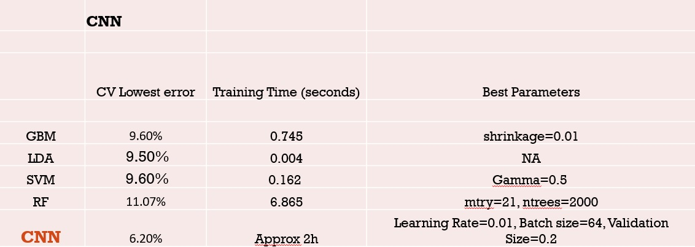

# Project: Dogs, Fried Chicken or Blueberry Muffins?


### [Full Project Description](doc/project3_desc.md)

Term: Fall 2017

+ Team 1
+ Team members
	+ Christina Huang
	+ Henrique Saboya
	+ Yi Zhang
	+ Joaquim Lyrio
	+ Jing Zhao

+ Project summary: In this project, we proposed an improvement on the current classification engine to classify dogs, muffins and fried chicken in terms of running cost (storage, memory and time) and prediction accuracy. The baseline model for comparison uses Gradient Boosting Machine (GBM) with decision stumps on 5000 SIFT features. Our proposed model consists of a Convolutional Neural Network with 2 convolutional layers. Before attaining the best model, we tried a different range of feature extraction methods, such as HOG and PCA, as well as different classification models, like LDA, Random Forest and SVM. We can observe the prediction accuracy estimated by cross-validation of each model using CNN feature extraction in the following table:


	
**Contribution statement**: 
Christina Huang - CNN model and HOG/CNN feature extraction
Henrique Saboya - PCA with HOG and LDA
Jing Zhao - LBP feature extraction and random forest model
Joaquim Lyrio - General structure and model testing
Yi Zhang - Baseline model and Presentation

Following [suggestions](http://nicercode.github.io/blog/2013-04-05-projects/) by [RICH FITZJOHN](http://nicercode.github.io/about/#Team) (@richfitz). This folder is orgarnized as follows.

```
proj/
├── lib/
├── data/
├── doc/
├── figs/
└── output/
```

Please see each subfolder for a README file.
